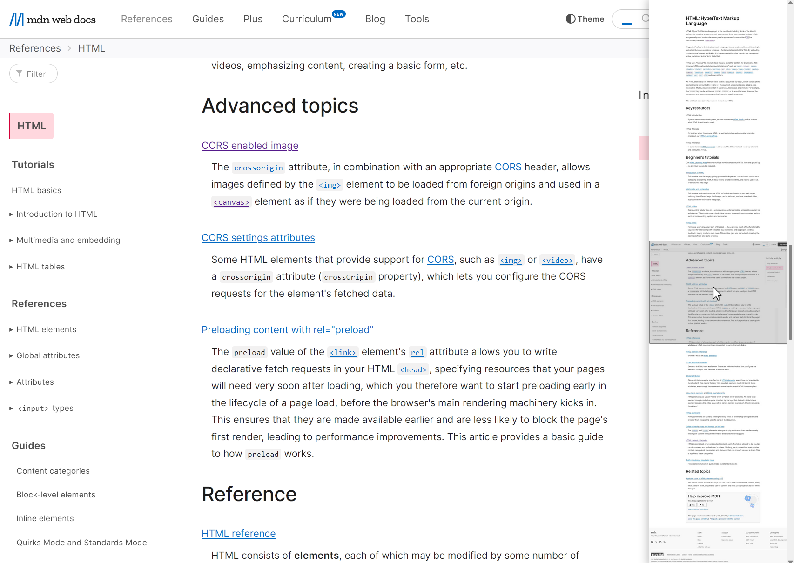

#  Lens Scrollbar browser extension

View a minimap of the whole page when you hover the scrollbar, and quckly jump to any part of page on click 

  

## Support
If you enjoy this project, please consider supporting further development by making a small donation using one of the services below 🙏 

 &nbsp;  &nbsp; 

## Privacy
This tool doesn't collect any private data. It is fully open source, and you can see the code on Github. It requires access to all urls in order to function properly.