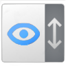

#  Scrollbar Lens

This browser extension shows a minimap of the whole page when you hover the scrollbar, allowing to quckly jump to any part of page on click. The currently visible part of the page is highlighted on the minimap as well. 

The minimap will appear only if the page is 2.5 times taller than the screen. Some images on the page may not shown on the minimap until they were scrolled into the view.

|  |
|-|

## Support
If you enjoy this project, please consider supporting further development by making a small donation using one of the services below 🙏 

 &nbsp;  &nbsp; 

## Privacy
This tool doesn't collect any private data. It is fully open source, and you can see the code on Github. It requires access to all urls in order to function properly.